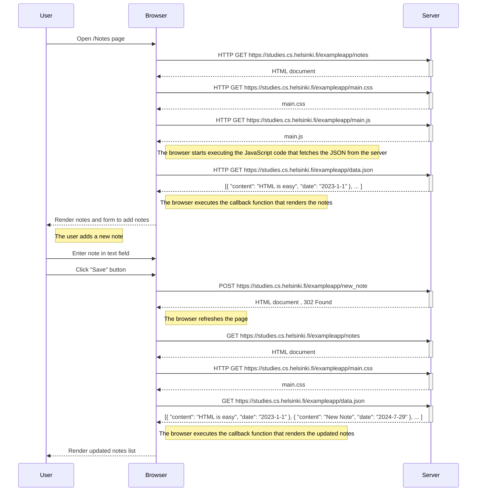

## Exercise 0.4

```mermaid
sequenceDiagram

    participant User
    participant Browser
    participant Server

    User->>Browser: Open /Notes page

    Browser->>Server: HTTP GET https://studies.cs.helsinki.fi/exampleapp/notes
    activate Server
    Server-->>Browser: HTML document
    deactivate Server

    Browser->>Server: HTTP GET https://studies.cs.helsinki.fi/exampleapp/main.css
    activate Server
    Server-->>Browser: main.css
    deactivate Server

    Browser->>Server: HTTP GET https://studies.cs.helsinki.fi/exampleapp/main.js
    activate Server
    Server-->>Browser: main.js
    deactivate Server

    Note right of Browser: The browser starts executing the JavaScript code that fetches the JSON from the server

    Browser->>Server: HTTP GET https://studies.cs.helsinki.fi/exampleapp/data.json
    Activate Server
    Server-->>Browser: [{ "content": "HTML is easy", "date": "2023-1-1" }, ... ]
    deactivate Server

    Note right of Browser: The browser executes the callback function that renders the notes

    Browser-->>User: Render notes and form to add notes

    Note right of User: The user adds a new note

    User->>Browser: Enter note in text field
    User->>Browser: Click "Save" button

    Browser->>Server: POST https://studies.cs.helsinki.fi/exampleapp/new_note
    activate Server
    Server-->>Browser: HTML document , 302 Found
    deactivate Server

    Note right of Browser: The browser refreshes the page

    Browser->>Server: GET https://studies.cs.helsinki.fi/exampleapp/notes
    activate Server
    Server-->>Browser: HTML document
    deactivate Server

    Browser->>Server: HTTP GET https://studies.cs.helsinki.fi/exampleapp/main.css
    activate Server
    Server-->>Browser: main.css
    deactivate Server

    Browser->>Server: GET https://studies.cs.helsinki.fi/exampleapp/data.json
    activate Server
    Server-->>Browser: [{ "content": "HTML is easy", "date": "2023-1-1" }, { "content": "New Note", "date": "2024-7-29" }, ... ]
    deactivate Server

    Note right of Browser: The browser executes the callback function that renders the updated notes

    Browser-->>User: Render updated notes list

```
