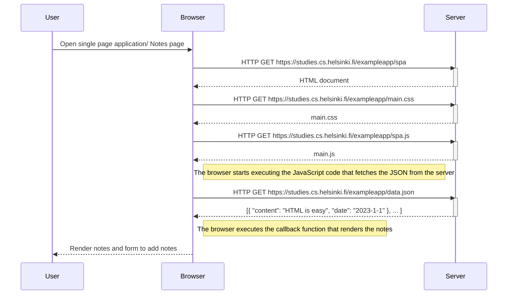

## Exercise 0.5

```mermaid
sequenceDiagram

    participant User
    participant Browser
    participant Server

    User->>Browser: Open single page application/ Notes page

    Browser->>Server: HTTP GET https://studies.cs.helsinki.fi/exampleapp/spa
    activate Server
    Server-->>Browser: HTML document
    deactivate Server

    Browser->>Server: HTTP GET https://studies.cs.helsinki.fi/exampleapp/main.css
    activate Server
    Server-->>Browser: main.css
    deactivate Server

    Browser->>Server: HTTP GET https://studies.cs.helsinki.fi/exampleapp/spa.js
    activate Server
    Server-->>Browser: main.js
    deactivate Server

    Note right of Browser: The browser starts executing the JavaScript code that fetches the JSON from the server

    Browser->>Server: HTTP GET https://studies.cs.helsinki.fi/exampleapp/data.json
    Activate Server
    Server-->>Browser: [{ "content": "HTML is easy", "date": "2023-1-1" }, ... ]
    deactivate Server

    Note right of Browser: The browser executes the callback function that renders the notes

    Browser-->>User: Render notes and form to add notes

```
